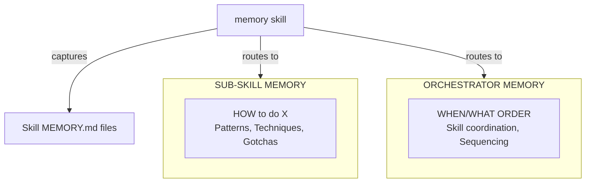
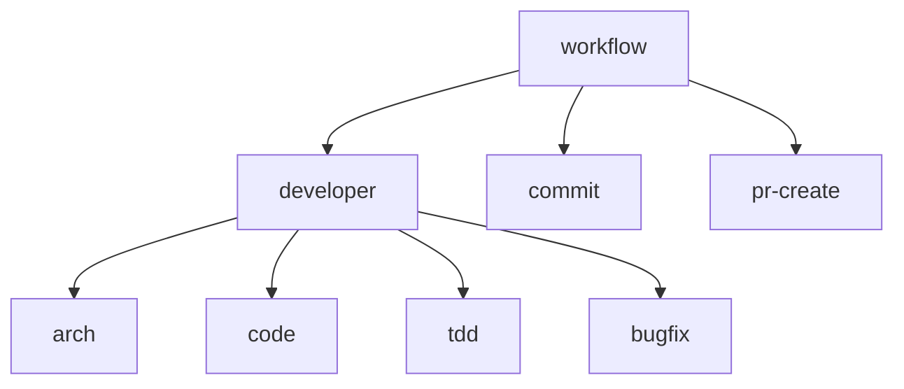

# Skill Analysis Report

## Summary

| Category | Count |
|----------|-------|
| Total Skills | 23 |
| Standalone (no infra) | 17 |
| With Skill Tasks | 2 |
| With User Tasks | 4 |
| Has `configure` command | 12 |
| Has `learn` command | 8 |
| Has `config_location` | 10 |
| Has `MEMORY.md` | 9 |
| Has `memory_integration` in collaboration | 8 |

---

## Configure and Learn Definitions

### `configure`
**One-time project analysis during framework setup.** Discovers patterns, tools, and conventions from existing project files and saves them to a config file. Requires user approval.

**Purpose:** Bootstrap the skill with project-specific knowledge so subsequent invocations use consistent, project-appropriate patterns.

**Typical flow:**
1. Scan project for indicators (configs, code patterns, directory structure)
2. Propose discovered configuration to user
3. User approves or modifies
4. Save to `.claude/skills/<skill>.yaml`

### `learn`
**Contextual update from specific path or source.** Analyzes a subset of the project to add new patterns to existing configuration. Used when encountering new areas of the codebase.

**Purpose:** Incrementally update configuration as the project evolves or when working in unfamiliar areas.

**Typical flow:**
1. Validate existing config exists (run `configure` first if not)
2. Analyze specified path for patterns
3. Compare to existing config, identify new patterns
4. Propose updates to user
5. Merge approved patterns into config

---

## Setup Type Classification

### Standalone Skills (17)
**setup.sh**: 44 lines - Copies skill only, no infrastructure

| Skill | Lines |
|-------|-------|
| arch | 44 |
| bugfix | 44 |
| code | 44 |
| commit | 44 |
| debugger | 44 |
| deploy | 44 |
| deploy-verify | 44 |
| domain-expert | 44 |
| linear | 44 |
| memory | 44 |
| pr-create | 44 |
| pr-merge | 44 |
| slack | 44 |
| tdd | 44 |
| workflow | 44 |
| workflow-finish | 44 |
| workflow-setup | 44 |

### With Skill Tasks (2)
**setup.sh**: 118 lines - Installs `Taskfile.skills.yaml` + framework scripts

| Skill | Installs |
|-------|----------|
| create-skill | Taskfile.skills.yaml, 9 validation scripts |
| docs-refresh | Taskfile.skills.yaml, 9 validation scripts |

### With User Tasks (4)
**setup.sh**: 132 lines - Installs `Taskfile.yaml` (user tasks) + framework scripts

| Skill | Installs |
|-------|----------|
| developer | Taskfile.yaml (test, lint, precommit), scripts |
| setup | Taskfile.yaml (test, lint, precommit), scripts |
| task | Taskfile.yaml (test, lint, precommit), scripts |
| test | Taskfile.yaml (test, lint, precommit), scripts |

---

## Bundle Configuration (configure/learn)

### Has `configure` + `learn` (8)

| Skill | Config Location | Configure | Learn |
|-------|-----------------|-----------|-------|
| **arch** | (in-memory/CLAUDE.md) | Discover architecture style, layers, boundaries | Learn from code imports, drift analysis |
| **code** | (in-memory) | Discover style from linter/formatter configs | Learn style from actual code patterns |
| **debugger** | `.claude/skills/debugger.yaml` | Analyze log access patterns, alert sources | Learn from specific service/log output |
| **deploy** | `.claude/skills/deploy.yaml` | Analyze CI/CD configuration | Update from recent deployment activity |
| **deploy-verify** | `.claude/skills/deploy-verify.yaml` | Detect deployment platform, services | Re-analyze deployment setup |
| **developer** | `.claude/skills/developer.yaml` | Analyze architecture patterns | Analyze specific path for patterns |
| **task** | `.claude/skills/task.yaml` | Analyze architecture, test conventions | Learn patterns from specific directory |
| **tdd** | `.claude/skills/tdd.yaml` | Analyze test framework, patterns | Analyze path, update config with patterns |

### Has `configure` only (4)

| Skill | Config Location | Configure |
|-------|-----------------|-----------|
| **docs-refresh** | `.claude/skills/docs-refresh.yaml` | Detect documentation structure |
| **test** | `.claude/skills/test.yaml` | Discover test framework, patterns, commands |
| **workflow-finish** | `.claude/workflow-config.json` | Configure workflow preferences |
| **workflow-setup** | `.claude/workflow-config.json` | Configure worktree preferences |

### No configure/learn (11)
Simple skills with fixed procedures:

| Skill | Description |
|-------|-------------|
| bugfix | Systematic bug investigation |
| commit | Git commits with conventional format |
| create-skill | Scaffold new skills |
| domain-expert | Domain knowledge reference |
| linear | Linear issue management |
| memory | Knowledge capture and routing (meta) |
| pr-create | Create GitHub PRs |
| pr-merge | Merge PRs with CI validation |
| setup | Project setup (runs other skills) |
| slack | Slack notifications |
| workflow | Orchestrates workflow-setup/finish |

---

## Additional Modes

Some skills have additional modes beyond configure/learn:

| Skill | Modes |
|-------|-------|
| **arch** | configure, learn, **check** (validate boundaries), **plan** (suggest layer for new code) |
| **code** | configure, learn, **check** (run linters), **guide** (writing guidance) |

---

## Skill Definition Files

### Complete (5 core files + optional MEMORY.md)
Core: skill.yaml, SKILL.md, sharp-edges.yaml, validations.yaml, collaboration.yaml

| Skill | Extra Files |
|-------|-------------|
| arch | MEMORY.md |
| bugfix | MEMORY.md |
| code | MEMORY.md |
| commit | - |
| create-skill | - |
| debugger | MEMORY.md |
| deploy | - |
| deploy-verify | - |
| developer | MEMORY.md |
| docs-refresh | - |
| linear | - |
| memory | - |
| pr-create | git-workflow.md |
| pr-merge | - |
| setup | - |
| task | MEMORY.md |
| tdd | MEMORY.md |
| workflow | MEMORY.md |
| workflow-setup | - |

### Missing `validations.yaml`

| Skill | Files Present |
|-------|---------------|
| slack | skill.yaml, SKILL.md, sharp-edges.yaml, collaboration.yaml |
| workflow-finish | skill.yaml, SKILL.md, sharp-edges.yaml |

### Missing Multiple Files

| Skill | Missing |
|-------|---------|
| **code** | sharp-edges.yaml |
| **domain-expert** | sharp-edges.yaml, collaboration.yaml |
| **test** | sharp-edges.yaml |

---

## Detailed Skill Matrix

| Skill | Setup Type | Infra Deps | configure | learn | config_location | MEMORY.md | Files |
|-------|------------|------------|-----------|-------|-----------------|-----------|-------|
| arch | standalone | - | ✓ | ✓ | - | ✓ (sub) | 5/5 |
| bugfix | standalone | - | - | - | - | ✓ (sub) | 5/5 |
| code | standalone | - | ✓ | ✓ | - | ✓ (sub) | 4/5 |
| commit | standalone | - | - | - | - | - | 5/5 |
| create-skill | skill-tasks | Taskfile.skills, scripts | - | - | - | - | 5/5 |
| debugger | standalone | - | ✓ | ✓ | `.claude/skills/debugger.yaml` | ✓ (sub) | 5/5 |
| deploy | standalone | - | ✓ | ✓ | `.claude/skills/deploy.yaml` | - | 5/5 |
| deploy-verify | standalone | - | ✓ | ✓ | `.claude/skills/deploy-verify.yaml` | - | 5/5 |
| developer | user-tasks | Taskfile, scripts | ✓ | ✓ | `.claude/skills/developer.yaml` | ✓ (orch) | 5/5 |
| docs-refresh | skill-tasks | Taskfile.skills, scripts | ✓ | - | `.claude/skills/docs-refresh.yaml` | - | 5/5 |
| domain-expert | standalone | - | - | - | - | - | 3/5 |
| linear | standalone | - | - | - | - | - | 5/5 |
| **memory** | standalone | - | - | - | - | - | 5/5 |
| pr-create | standalone | - | - | - | - | - | 5/5 +git-workflow.md |
| pr-merge | standalone | - | - | - | - | - | 5/5 |
| setup | user-tasks | Taskfile, scripts | - | - | - | - | 5/5 |
| slack | standalone | - | - | - | - | - | 4/5 |
| task | user-tasks | Taskfile, scripts | ✓ | ✓ | `.claude/skills/task.yaml` | ✓ (orch) | 5/5 |
| tdd | standalone | - | ✓ | ✓ | `.claude/skills/tdd.yaml` | ✓ (sub) | 5/5 |
| test | user-tasks | Taskfile, scripts | ✓ | - | `.claude/skills/test.yaml` | - | 4/5 |
| workflow | standalone | - | - | - | - | ✓ (orch) | 5/5 |
| workflow-finish | standalone | - | ✓ | - | `.claude/workflow-config.json` | - | 3/5 |
| workflow-setup | standalone | - | ✓ | - | `.claude/workflow-config.json` | - | 5/5 |

---

## Discovery Sections

Skills with explicit `discovery:` sections for auto-detection patterns:

| Skill | Discovery Covers |
|-------|------------------|
| **deploy-verify** | Platform indicators (k8s, cloud run, docker-compose, ECS, serverless), CI/CD indicators |
| **developer** | Architecture detection (layered, modular, flat, monorepo), import rules, test patterns |

---

## Infrastructure Dependencies

### Framework Scripts (installed by 6 skills)
```
add-skill-to-claudemd.sh
audit-skills.sh
check-skill-structure.sh
check-skill-yaml.sh
generate-skills-reference.sh
get-config-path.sh
list-skills.sh
post-install.sh
validate-skill.sh
```

### Taskfile.dev.yaml → .claude/Taskfile.yaml (user tasks) - 4 skills
Source: `infra/Taskfile.dev.yaml`
Destination: `.claude/Taskfile.yaml`
Provides: `test`, `lint`, `precommit` tasks
Installed by: developer, setup, task, test

### Taskfile.skills.yaml (skill tasks) - 2 skills
Source: `infra/Taskfile.skills.yaml`
Destination: `.claude/Taskfile.skills.yaml`
Provides: `validate-skill`, `validate-skill-yaml`, `check-structure`, `audit-skills`
Installed by: create-skill, docs-refresh

---

## Hooks Configuration

All 23 skills have identical hooks.json structure:
```json
{
  "hooks": {
    "Setup": [{
      "hooks": [{
        "type": "command",
        "command": "${CLAUDE_PLUGIN_ROOT}/scripts/setup.sh"
      }]
    }]
  }
}
```

---

## Config Location Summary

| Config File | Skills Using It |
|-------------|-----------------|
| `.claude/skills/debugger.yaml` | debugger |
| `.claude/skills/deploy.yaml` | deploy |
| `.claude/skills/deploy-verify.yaml` | deploy-verify |
| `.claude/skills/developer.yaml` | developer |
| `.claude/skills/docs-refresh.yaml` | docs-refresh |
| `.claude/skills/task.yaml` | task |
| `.claude/skills/tdd.yaml` | tdd |
| `.claude/skills/test.yaml` | test |
| `.claude/workflow-config.json` | workflow-finish, workflow-setup |

---

## Memory Architecture

### Overview

Skills accumulate knowledge through two mechanisms:
1. **Configuration** (`configure`/`learn`) - Project structure discovery, saved to YAML
2. **Memory** (`MEMORY.md`) - Experiential learnings from doing work



### Memory vs Configuration

| Aspect | Configuration | Memory |
|--------|---------------|--------|
| **File** | `.claude/skills/<skill>.yaml` | `MEMORY.md` in skill dir |
| **Created** | `configure` command | Accumulated during work |
| **Updated** | `learn` command | `memory capture` or manual |
| **Content** | Project structure facts | Experiential learnings |
| **Example** | "Test framework is vitest" | "Always mock X before Y" |
| **Scope** | What exists | What works |

### Memory Scopes

#### Sub-Skill Memory (Domain Knowledge)
**Question answered:** "HOW do I do X well?"

| Skill | Memory Captures |
|-------|-----------------|
| **bugfix** | Debugging strategies, common root causes, investigation patterns |
| **tdd** | Test writing patterns, assertion styles, mock strategies |
| **arch** | Boundary decisions, violation patterns encountered, layer rationale |
| **code** | Style edge cases, linter workarounds, naming decisions |
| **debugger** | Log analysis patterns, alert triage, service-specific quirks |

#### Orchestrator Memory (Workflow Knowledge)
**Question answered:** "WHEN and in WHAT ORDER do I invoke skills?"

| Skill | Memory Captures |
|-------|-----------------|
| **developer** | Skill coordination, implementation sequences, validation order |
| **task** | Task execution patterns, checkpoint sequences |
| **workflow** | Branch strategies, PR preferences, workflow customizations |

### MEMORY.md Structure

#### Sub-Skill Template
```markdown
# {Skill} Memory

Domain-specific learnings from {skill} sessions.

## Patterns
<!-- Techniques that work well -->

## Gotchas
<!-- Things to watch out for -->

## Project-Specific
<!-- Learnings specific to this codebase -->
```

#### Orchestrator Template
```markdown
# {Skill} Memory

Workflow learnings from {skill} orchestration.

## Skill Coordination
<!-- Which skills to invoke, in what order -->

## Sequencing Rules
<!-- What must happen before/after what -->

## Project Workflows
<!-- Project-specific workflow preferences -->
```

### Skills with MEMORY.md

| Category | Skill | Scope | Status |
|----------|-------|-------|--------|
| **Sub-skill** | bugfix | Domain (debugging) | Done |
| **Sub-skill** | tdd | Domain (testing) | Done |
| **Sub-skill** | arch | Domain (architecture) | Done |
| **Sub-skill** | code | Domain (style) | Done |
| **Sub-skill** | debugger | Domain (production debug) | Done |
| **Orchestrator** | developer | Workflow | Done |
| **Orchestrator** | task | Workflow | Done |
| **Orchestrator** | workflow | Workflow | Done |
| **Meta** | memory | Routes knowledge | Done |

### Memory Skill Role

The `memory` skill (`plugins/memory/`) orchestrates knowledge capture:

```
/memory capture "learned X"  → Routes to appropriate MEMORY.md
/memory review [skill]       → Shows accumulated knowledge
/memory consolidate          → Deduplicates, organizes
```

**Routing logic:**
1. Analyze the learning content
2. Determine if it's domain knowledge (HOW) or workflow knowledge (WHEN/ORDER)
3. Route to appropriate skill's MEMORY.md
4. If unclear, ask user to clarify scope

**Routing keywords per skill:**

| Skill | Keywords | Scope |
|-------|----------|-------|
| bugfix | debug, diagnose, root cause, stack trace | sub-skill |
| tdd | test, mock, assert, coverage, TDD | sub-skill |
| arch | architecture, layer, boundary, module, dependency | sub-skill |
| code | style, format, idiom, naming, convention, lint | sub-skill |
| debugger | production, logs, monitoring, incident, alert | sub-skill |
| developer | workflow, implementation, order, process | orchestrator |
| task | priority, task, organize, plan | orchestrator |
| workflow | coordinate, sequence, trigger, chain | orchestrator |

### Skill Integration

All 8 memory-enabled skills have a `memory_integration` block in their collaboration.yaml:

```yaml
memory_integration:
  reads: "MEMORY.md for <skill-specific knowledge>"
  writes_via: "memory skill routes learnings here"
  capture_triggers:
    - "<when to suggest capturing>"
```

### Current Developer MEMORY.md Analysis

The existing developer MEMORY.md contains mixed scopes:

| Section | Current Location | Should Be |
|---------|------------------|-----------|
| Domain Implementation Patterns | developer | **code** or **arch** (domain knowledge) |
| Review Process | developer | developer (workflow) ✓ |
| Git Workflow | developer | developer (workflow) ✓ |

**Recommendation:** Split domain patterns to appropriate sub-skill memories

---

## Skill Collaborations

### Overview

Skills collaborate through defined interfaces in `collaboration.yaml`. This enables:
- **Orchestration**: Higher-level skills delegate to specialized skills
- **Composition**: Skills work together in sequences
- **Interfaces**: Skills communicate through provides/receives contracts



### Skill Dependencies

| Skill | Depends On | Dependency Type |
|-------|------------|-----------------|
| **bugfix** | tdd | optional - Uses TDD principles for failing test |
| **code** | arch | optional - Layer context for style rules |
| **commit** | workflow, pr-create, code | complementary |
| **create-skill** | arch, code | complementary |
| **developer** | code (required), tdd (optional) | orchestrates both |
| **linear** | developer | optional - Receives plan/context |
| **pr-create** | - | standalone |
| **pr-merge** | - | standalone |
| **tdd** | - | standalone |
| **workflow** | developer, bugfix | orchestrates both |

### Provides/Receives Interface

Skills communicate through defined interfaces:

#### Architecture Skill (arch)
**Provides to:**
| To Skill | Mode | What it Provides |
|----------|------|------------------|
| developer | plan | layer_assignments, file_locations, reasoning |
| code | check | layer_context, allowed_imports |

**Receives from:**
| From Skill | What it Receives |
|------------|------------------|
| developer | change_description |
| workflow | validation_request |

#### Code Skill (code)
**Provides to:**
| To Skill | Mode | What it Provides |
|----------|------|------------------|
| developer | guide | style_rules, mindset |
| commit | check | validation results |
| arch | - | layer_context |

**Receives from:**
| From Skill | What it Receives |
|------------|------------------|
| arch | layer_info |
| developer | implementation_context |

#### Bugfix Skill (bugfix)
**Provides to:**
| To Skill | What it Provides |
|----------|------------------|
| developer | root_cause, fix_scope |
| workflow | bug_report |

**Receives from:**
| From Skill | What it Receives |
|------------|------------------|
| developer | bug_description, reproduction_context |

### Composition Sequences

Common skill sequences for different workflows:

#### Feature Development
```
developer → arch (plan) → code (guide) → tdd → commit → pr-create
```

#### Bug Fix
```
developer → bugfix → tdd (failing test) → commit → pr-create
```

#### Code Review Preparation
```
code (check) → arch (check) → commit
```

#### Workflow Start
```
workflow → workflow-setup → developer
```

### Collaboration Boundaries

Each skill has defined boundaries to avoid overlap:

| Skill | Handles | Does NOT Handle |
|-------|---------|-----------------|
| **commit** | Message generation, staging guidance, commit safety | Branch management, PR creation, pushing |
| **pr-create** | PR creation, title formatting, body generation | Committing, branch creation, merging |
| **pr-merge** | Merge execution, CI validation, branch cleanup | PR creation, commit changes |
| **bugfix** | Root cause analysis, investigation | Fix implementation, testing |
| **tdd** | Test writing, TDD cycle | Production code (that's developer) |
| **arch** | Layer guidance, boundary validation | Code style, implementation |
| **code** | Style enforcement, naming conventions | Architecture, business logic |

### Integration Patterns

#### Pre-Implementation Planning
```yaml
pattern: "pre-implementation-planning"
description: |
  Before writing code, developer skill asks arch for layer guidance.
  This prevents architecture violations from being introduced.
```

#### Test-First Development
```yaml
pattern: "test-driven-development"
description: |
  Developer delegates to tdd for core logic:
  1. Write failing test
  2. Implement minimal code
  3. Refactor
```

#### Structured Debugging
```yaml
pattern: "structured-bug-investigation"
description: |
  Developer delegates to bugfix for systematic investigation:
  1. Reproduce
  2. Failing test
  3. Root cause
  4. Minimal fix
```

### Skills Without Collaborations

These skills operate independently:

| Skill | Why Standalone |
|-------|----------------|
| **memory** | Meta skill - routes to other skills |
| **slack** | External notification only |
| **domain-expert** | Reference knowledge only |
| **deploy** | Deployment procedure |
| **deploy-verify** | Post-deployment checks |
| **docs-refresh** | Documentation generation |

---

## Plugin Review Checklist

When reviewing or creating plugins, validate against this checklist:

| # | Check | Requirement |
|---|-------|-------------|
| 1 | **Version sync** | `plugin.json` version matches `skill.yaml` version (all 1.0.0) |
| 2 | **Taskfile paths** | Skill tasks use `.claude/Taskfile.skills.yaml`, user tasks use `.claude/Taskfile.yaml` |
| 3 | **Task prefixes** | No `claude:` prefix in task names |
| 4 | **Infra naming** | `setup.sh` uses `INFRA_ROOT` not `FRAMEWORK_ROOT` |
| 5 | **GitHub URLs** | Use `main/infra` not `main/framework` |
| 6 | **validations.yaml** | Use `id` only (no redundant `name` field) |
| 7 | **collaboration.yaml** | No `triggers:` section (triggers don't work - loaded post-invocation) |
| 8 | **Stop hooks** | Opt-in only (via `/create-skill`) |
| 9 | **SKILL.md docs** | Stop hook documentation matches `validations.yaml` `on_stop` implementation |

### Taskfile Mapping

| Source | Destination | Contains |
|--------|-------------|----------|
| `infra/Taskfile.dev.yaml` | `.claude/Taskfile.yaml` | User tasks: test, lint, precommit |
| `infra/Taskfile.skills.yaml` | `.claude/Taskfile.skills.yaml` | Skill tasks: validate-skill, check-structure |

### Task Type Reference

| Task Type | Taskfile | Example |
|-----------|----------|---------|
| **User tasks** | `.claude/Taskfile.yaml` | `task -t .claude/Taskfile.yaml test` |
| **Skill tasks** | `.claude/Taskfile.skills.yaml` | `task -t .claude/Taskfile.skills.yaml validate-skill` |
